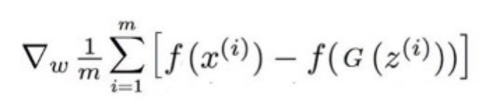
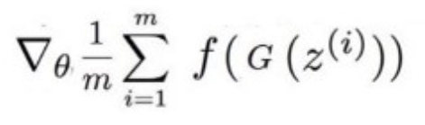

# Conditional-WGAN-GP

Paper: https://arxiv.org/pdf/1701.07875.pdf

Implementation of a Wasserstein Generative Adversarial Network with Gradient Penalty to enforce lipchitz constraint. The WGAN utilizes the wasserstein loss or critic as its loss function instead of the vanilla GAN loss. It has shown to perform better as is often used as a solution to mode collapse, a common issue in GANs where the generator produces limited variation after finding a way to trick the discriminator into always losing. This cycle forces the generator to not produce any new variation. The Wasserstein loss is also known as the Earth Mover Distance.

## The Wasserstein Critic for Discriminator is:

## The Wasserstein Loss for Generator is:

### Epoch Progression of Wasserstein GAN

Some ways to improve performance as well as quality of images is to increase the iteration of Discriminator training. This means that the discriminator is trained more times than the generator. Also a fully convolutional architecture will perform better at producing synthetic images.
